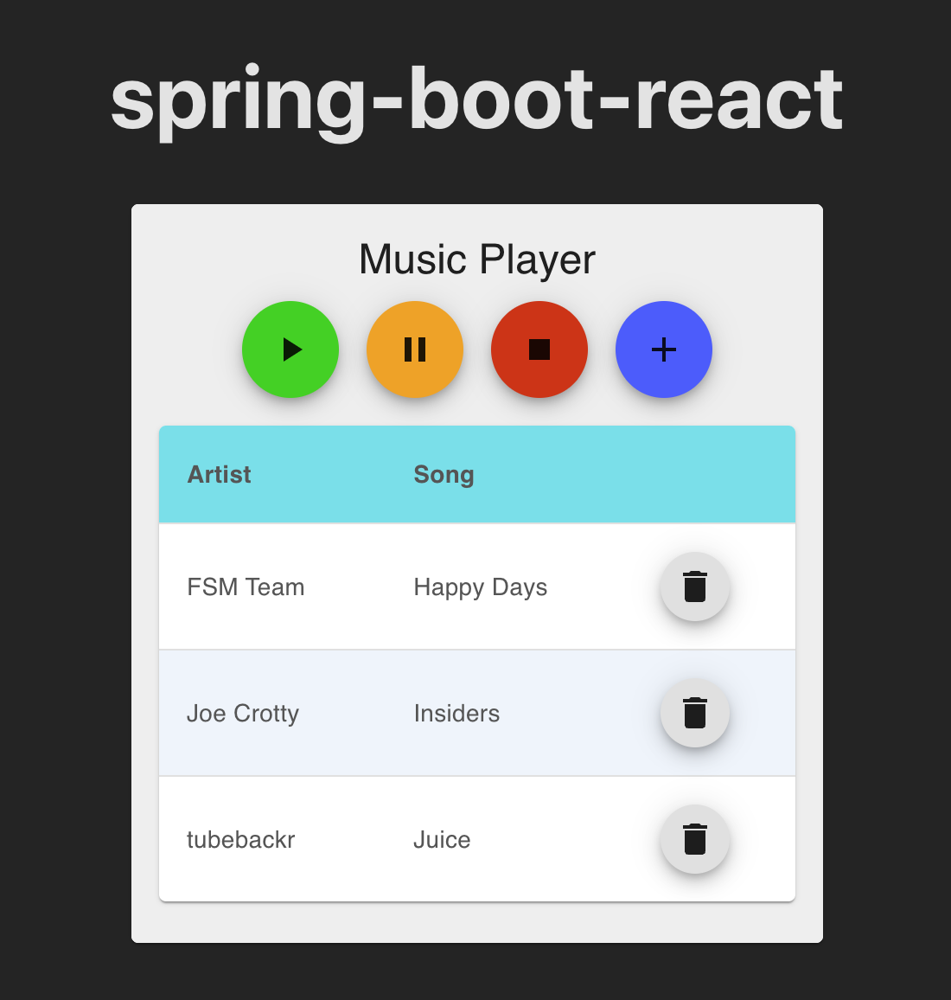

# spring-boot-react
A reminder to myself about the awesome capabilities of Java + Spring Boot.

This demo project features a Spring Boot backend integrated with a web interface that communicates with the RESTful service. The backend functions as a music player, utilizing the vlcj library to handle media playback, while the frontend provides user controls.

Note: I might evolve this project into a more traditional React web application, with the backend serving solely as a RESTful API.

Steps to creating a RESTful API in Spring Boot:
1. Project Setup with Spring Initializr
2. Building Data Model
    - Here we need to define Java classes that represent the data that we want to expose through our API (Entities), ex. Song
    - These classes should have fields, getters and setters for the properties we want to store.
    - To interract with the database, we need to create repository interfaces. This is where we need to add the dependancy for Spring Data JPA.
3. Handle Service Layer
    - Here we implement the service classes to encapsulate business logic related to the data. These classes can perform complex operations such as data validation, business reinforcement and data transformation.
4. Define Controllers
    - Controller classes that handle incoming HTTP requests and return appropriate responses.
5. Configure Application Properties
    - Database connection details, server port, etc.
6. Run Application
    - API testing with:
        - Postman
        - curl

